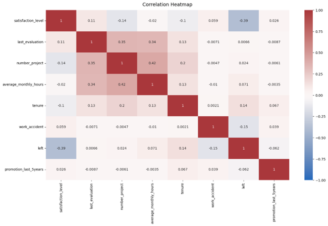
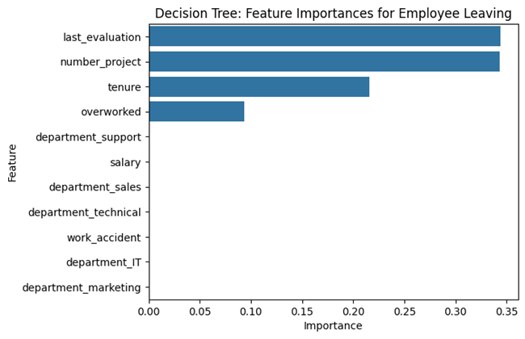
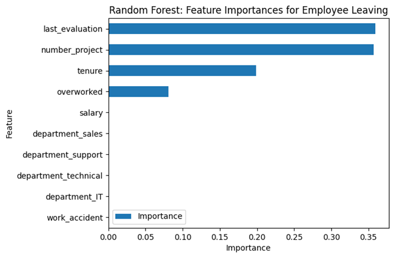

## Predictive Retention Modeling at Salifort Motors

**The Mission:** How can a large consulting firm move from reactive hiring to proactive retention? As a Data Analyst, I spearheaded a project for Salifort Motors to answer this $1M+ question: Can we predict which employees are likely to leave before they submit their resignation?

**The Technical Deep-Dive:** Using a dataset of over 14,000 employees, I built and tuned a Random Forest Classifier (and evaluated Logistic Regression) to identify the "burnout threshold."
**•	Key Skills:** Python (Pandas, Scikit-Learn), Hyperparameter Tuning (GridSearchCV), Data Visualization (Seaborn/Matplotlib).
**•	Problem Solving:** Overcame complex data type constraints and optimized multi-metric scoring (F1, ROC-AUC) to ensure model reliability.

**The Impact:** My analysis revealed that employee churn wasn't just about satisfaction—it was highly correlated with "project overloading" and a specific "5-year tenure itch." I translated these technical findings into an Executive Summary for leadership, proposing a 15% reduction in turnover through targeted workload balancing.

**Ethical Excellence:** A core part of this project was developing an ethical framework. I audited the model for bias and ensured that the "human" remained in Human Resources, using the AI as a support tool for employee well-being rather than a decision-maker for termination.

## 🚀 How to Run This Project
To replicate this analysis on your local machine, follow these steps:

1. **Prerequisites**
Ensure you have Python 3.9+ installed. I recommend using a virtual environment to avoid dependency conflicts.

2. **Installation**
Clone the repository and install the required libraries:
```
git clone https://github.com/segmur/Predictive-Retention-Modeling-Project.git
cd salifort-motors-retention
pip install -r requirements.txt
```

3. **Environment Setup**
If you are using Jupyter Notebook or VS Code, ensure your kernel is set to the environment where these packages are installed.

4. **Dependencies (requirements.txt)**
Create a file named requirements.txt in your root folder with the following content:

```
pandas>=2.0.0
numpy>=1.24.0
matplotlib>=3.7.0
seaborn>=0.12.0
scikit-learn>=1.2.0
jupyter>=1.0.0
```

## 🛠️Troubleshooting Notes
During development, I documented and resolved two critical environment-specific issues:

**Correlation Errors:** Fixed a ValueError in df.corr() by explicitly setting numeric_only=True to handle categorical "Sales" and "Salary" columns.

**GridSearchCV Constraints:** Resolved an InvalidParameterError by switching the scoring parameter from a Python set {} to a list [], ensuring compatibility with Scikit-Learn's validation engine.

## Visuals



The correlation heatmap confirms that the number of projects, monthly hours, and evaluation scores all have some positive correlation with each other, and whether an employee leaves is negatively correlated with their satisfaction level.

**Insight**

It appears that employees are leaving the company as a result of poor management. Leaving is tied to longer working hours, many projects, and generally lower satisfaction levels. It can be ungratifying to work long hours and not receive promotions or good evaluation scores. There's a sizeable group of employees at this company who are probably burned out. It also appears that if an employee has spent more than six years at the company, they tend not to leave.







## Project Limitations & Future Scope
While the model achieved high predictive performance, there are several constraints that should be considered before full-scale implementation at Salifort Motors:

**Snapshot Bias:** The current dataset provides a "snapshot" of employee status. It lacks time-series data, which would allow us to see how an employee's satisfaction or hours trended over several months leading up to their departure.

**Qualitative Gaps:** The data is strictly quantitative. It does not capture "soft" factors such as relationship quality with direct managers, personal life changes, or specific exit interview feedback, which are often primary drivers of churn.

**The "Champion" Effect:** The model may flag high-performers who are working long hours because they are passionate and engaged, potentially misidentifying them as "burnout risks."

**Economic Variables:** External factors—such as a competitor opening a nearby office or a shift in the global consulting market—are not represented in this internal dataset but heavily influence turnover.

## Next Steps for Salifort Motors
To evolve this project, I recommend the following:

**Sentiment Analysis:** Incorporate text data from internal surveys or Glassdoor reviews using Natural Language Processing (NLP).

**A/B Testing:** Apply the recommended "Workload Cap" to one department and compare its turnover rate against a control group over six months.

**Dynamic Dashboarding:** Transition this static analysis into a real-time Power BI or Tableau dashboard for HR managers.
